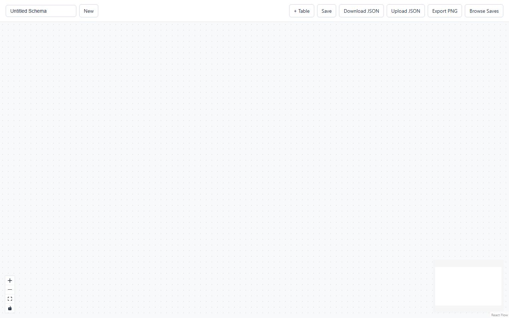
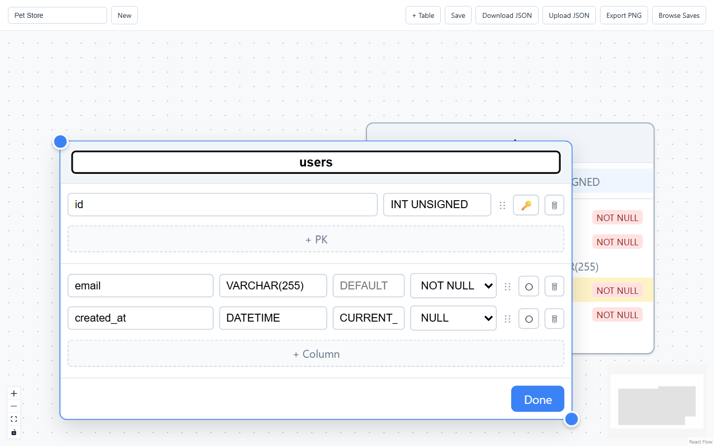
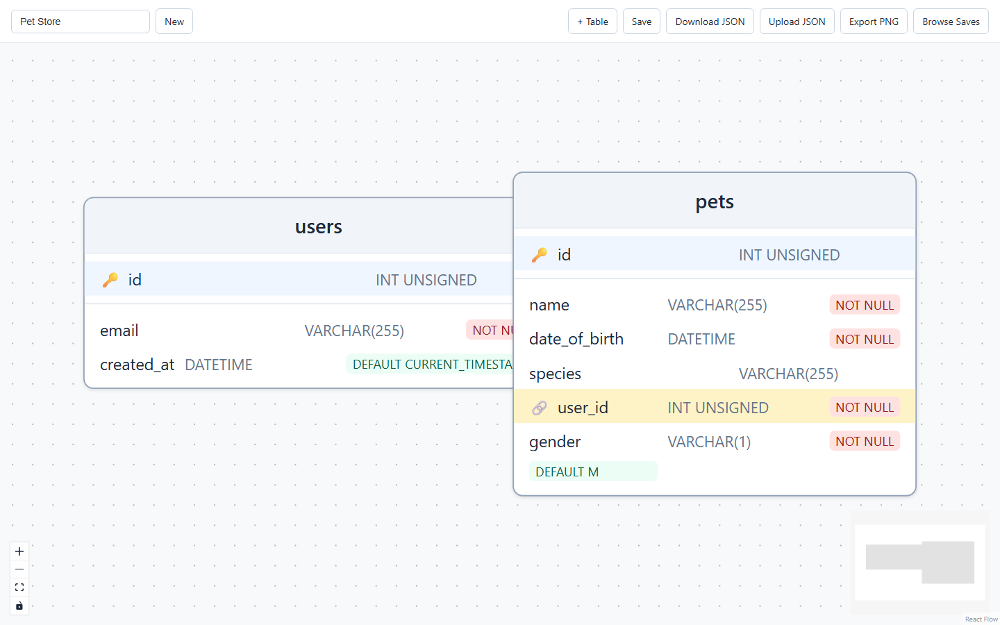
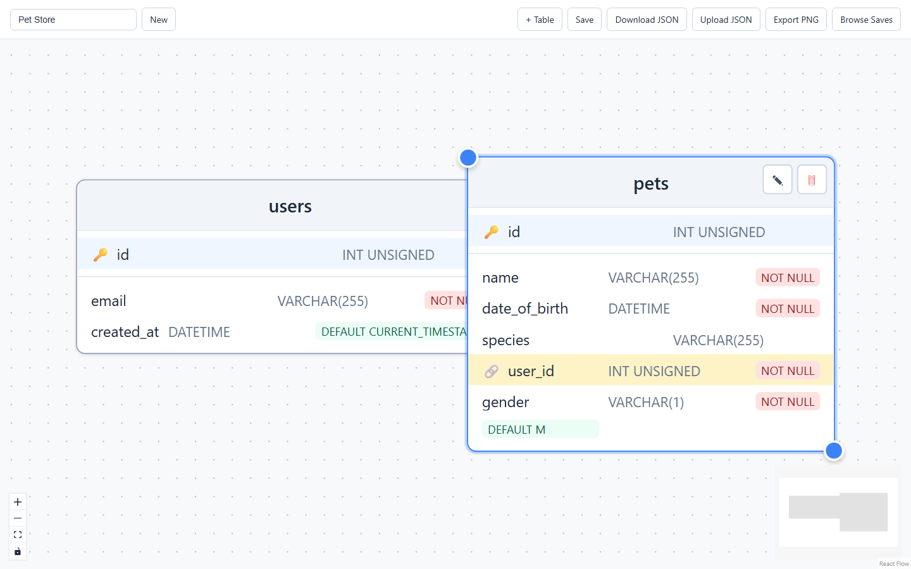
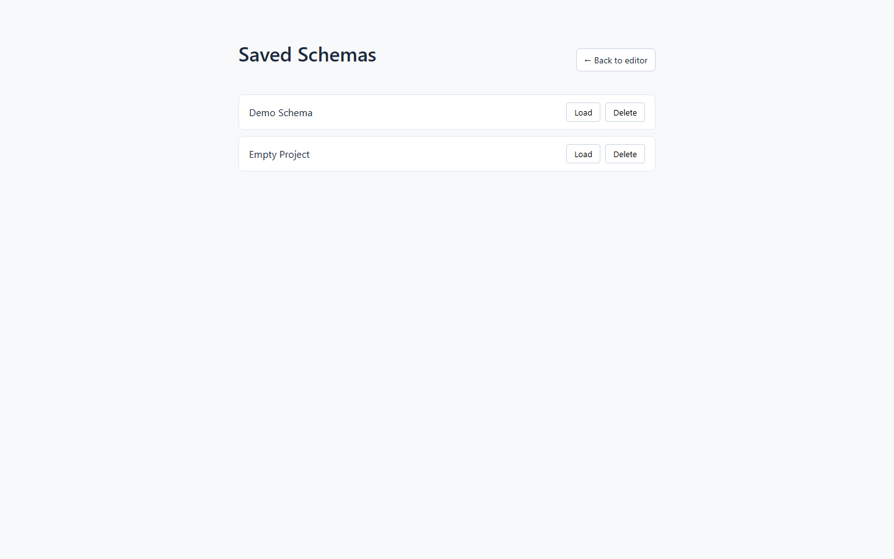

# Logical Schema Diagram Creator — User Guide

A frontend-only logical database schema designer. Build tables, define columns and primary keys, draw relationships, and export your work — all in the browser.

---

## Table of Contents

1. [Overview](#overview)
2. [The Main Canvas](#the-main-canvas)
3. [Creating a Table](#creating-a-table)
4. [Editing a Table](#editing-a-table)
5. [Column Options](#column-options)
6. [Reordering Columns](#reordering-columns)
7. [Creating Relationships](#creating-relationships)
8. [Saving Your Work](#saving-your-work)
9. [Export and Import](#export-and-import)
10. [Browsing Saved Schemas](#browsing-saved-schemas)

---

## Overview

The app is split into two views:

- **Editor** (`/`) — the main diagram canvas.
- **Saves Browser** (`/#/saves`) — manage schemas stored in the browser.

Everything is stored locally in your browser. No account or server is required.

---

## The Main Canvas

When you open the app you see an empty canvas with a toolbar at the top.

| Toolbar item | Purpose |
|--------------|---------|
| **Schema name** input | Name the current schema. |
| **New** | Clear the canvas and start over. |
| **+ Table** | Add a new table. |
| **Save** | Save a named snapshot to browser storage. |
| **Download JSON** | Save the schema as a `.json` file. |
| **Upload JSON** | Load a previously downloaded `.json` file. |
| **Export PNG** | Download an image of the current canvas. |
| **Browse Saves** | Open the saves browser. |

You can pan the canvas by dragging the background and zoom with the mouse wheel or the controls in the bottom-left corner.

---

## Creating a Table

1. Click **+ Table** in the toolbar.
2. Enter a table name in the prompt.
3. The table appears on the canvas.

To move a table, drag its header.

---

## Editing a Table

Double-click a table, or click the ✎ icon that appears when you hover over it, to enter edit mode.

In edit mode you can:

- **Rename the table** by editing the header input.
- **Add a primary key column** with the **+ PK** button.
- **Add a normal column** with the **+ Column** button.
- **Edit a column's name** and **data type**.
- **Toggle primary key** status with the ○ / 🔑 button.
- **Delete a column** with the 🗑 button.

Click **Done** or click outside the table to save your changes.

Tables are divided into two sections:

- **Primary key columns** — shown with a 🔑 key icon.
- **Normal columns** — shown below the divider.

---

## Column Options

For normal (non-primary-key) columns you can set:

- **DEFAULT** — a default value such as `0`, `'active'`, or `CURRENT_TIMESTAMP`.
- **NULL / NOT NULL** — choose whether the column allows null values.

These settings are shown as badges when the table is not in edit mode.

| Badge | Meaning |
|-------|---------|
| **NOT NULL** | The column does not allow null values. |
| **DEFAULT _value_** | The column has a default value. |
| **🔗** | The column is a foreign key. |

---

## Reordering Columns

While a table is in edit mode, drag the **⋮⋮** handle on the left side of a column row to reorder it. Reordering is limited to the same section: primary keys reorder only among primary keys, and normal columns only among normal columns.

---

## Creating Relationships

Relationships are created by dragging the blue handles that appear on a selected table.

- **Lower-right handle** → drag to another table to create a foreign key **from** the source table **in** the destination table.
- **Upper-left handle** → drag to another table to create a foreign key **to** the destination table **in** the source table.

After you drop the handle, the **Relationship Mapping** modal opens. Choose which source column maps to which target column, then confirm. Foreign-key columns are highlighted with a 🔗 icon on the table node, and a line is drawn between the related tables.

---

## Saving Your Work

The current schema is automatically saved to `localStorage` as you work. You can also click **Save** to store a named snapshot.

---

## Export and Import

- **Download JSON** exports the full schema to a `.json` file you can keep or share.
- **Upload JSON** loads a `.json` file back into the app.
- **Export PNG** saves the current canvas as an image.

---

## Browsing Saved Schemas

Click **Browse Saves** to open the saves browser.

From here you can:

- Load a saved schema into the editor.
- Rename a saved schema.
- Delete a saved schema.
