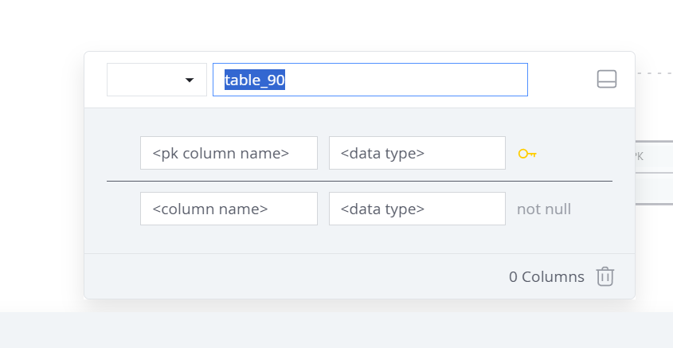
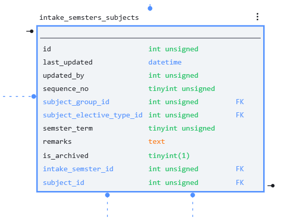

This is a logical schema diagram drawer, much like https://www.sqldb.com

# REQUIREMENTS

1. User can create a blank canvas and place a table in the canvas, and a pop-up will ask me for the table name
2. Double on the table to edit it. It's possible to edit the name, and also
   -  interface from sqldbm: 
    - add a new column, giving it a name and a datatype (use MySQL data types)
    - user can type in their own datatype, besides the recongized MySQL ones
    - primary key colums and normal columns are in two different parts of the table editing interface
3. users can create relationships:
    
    - When the user clicks on a table, at the upper left and lower right corner appears two controls which the user can use to add relationsho
    - if the user drags the lower right corner control to another table, then create a FK from the SOURCE table in the DESTINATION table
    - if the user drags the upper left corner control to another table, then create a FK TO the DESTINATION table in the original table
    - the user is then asked WHICH KEY FROM THE ORIGINAL TABLE MATCHES TO WHICH KEY IN THE DEST TABLE
    - the key that is the FK must be clearly presented
    - lines must be drawn between related tables   
4. users can reposition tables
5. When saving, save the table as JSON in the localstorage
6. Can export as PNG
7. Can download the JSON format
8. Can reupload the JSON format to open the file.
9. Can browse localstorage JSON formats

# SOFTWARE ARCHITECTURE
- Use React with TypeScript
- Use Jotai and wouter
- create reusable components and reducers

